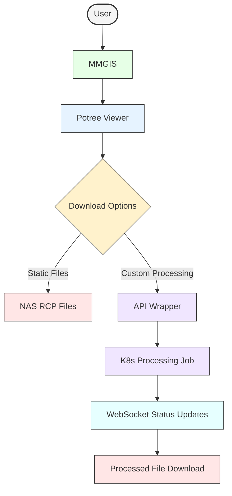

# AddLidar Project Documentation

## Project Overview

The AddLidar Project is a web-based system for storing, processing, and visualizing LiDAR datasets collected from airborne missions. The goal is to provide researchers with an efficient pipeline to access, process, and visualize large LiDAR datasets via a Kubernetes-based infrastructure.

## System Components

The system consists of multiple integrated components:

- **MMGIS**: A web interface for managing missions, allowing researchers to input mission metadata and file locations.
- **Potree**: A LiDAR visualization tool that loads pre-processed datasets from ENAC IT CDN.
- **API Wrapper**: A REST API that converts user queries into commands for the processing pipeline.
- **LidarDataManager CLI**: A command-line tool for filtering, processing, and exporting LiDAR datasets.
- **WebSocket Server**: Provides real-time progress updates for long-running processing jobs.

### Storage Infrastructure:

- **NAS RCP**: The primary storage for raw LiDAR datasets and static mission files.
- **ENAC IT CDN**: Stores optimized datasets converted by Potree Converter.
- **Kubernetes Infrastructure**: Hosts the API, WebSocket server, and job management, ensuring secure access to data.

## Workflow: Adding a New Mission


1. **Researcher Adds New Files (NAS RCP)**:

   - The researcher places new LiDAR files in the NAS RCP storage (e.g., `/0001_Mission_Root/...`).

2. **Enter Mission Metadata (MMGIS)**:

   - The researcher manually enters the mission's metadata into MMGIS, including:
     - Mission footprint in GeoJSON
     - Flight date
     - File path referencing the newly added LiDAR files on NAS RCP

3. **Automated Conversion & Upload**:

   - Adding a new mission in MMGIS automatically triggers a Kubernetes job
   - The job runs Potree Converter to process the LiDAR files
   - The optimized dataset (e.g., octree.bin, metadata.json, hierarchy.bin) is uploaded to ENAC IT CDN
   - Files are stored under a path like `enacit4r-cdn.epfl.ch/AddLidar/{ID_NAME}/`

4. **Mission Ready for Visualization**:
   - Once processing is complete, MMGIS automatically includes a mission link pointing to the Potree web interface
   - Users can follow this link to view the newly added LiDAR dataset in Potree

## Workflow: Exploring and Processing Missions



1. **Dataset Selection (MMGIS)**:

   - A user browses the mission list in MMGIS, which displays mission footprints as GeoJSON overlays
   - User selects a mission of interest
   - The system provides a link to Potree for visualization

2. **Visualization (Potree)**:

   - Potree loads the pre-processed LiDAR files directly from ENAC IT CDN
   - The user can explore the dataset through Potree's 3D viewer (pan, zoom, measure, etc.)

3. **Download Options**:

   - **Static Files**: Users can directly download original or pre-processed static files associated with the mission
   - **Custom Processing**: Users can request on-demand processing with custom parameters

4. **Request Processed Dataset (Custom Processing)**:

   - Within Potree, the user fills out the download form (filters, density, output format, ROI, etc.)
   - Submitting the form sends these parameters as a request to the API Wrapper

5. **On-Demand Processing Pipeline**:

   - API Wrapper receives the request and initiates a Kubernetes job
   - A WebSocket connection is established between the client and server
   - The job executes the LidarDataManager CLI with the requested parameters
   - The CLI accesses the raw data via a read-only Persistent Volume Claim (PVC)

6. **Real-time Progress Updates**:

   - The processing job sends status updates via WebSocket to the client
   - Users see a progress bar/indicator showing the current status of their request

7. **Download Processed Data**:
   - Once processing is complete, a notification is sent via WebSocket
   - The user downloads the customized file through Potree's interface

## Detailed Architecture

### MMGIS (AddLidar-MMGIS)

- Provides a user interface where researchers manage mission metadata
- Each mission contains:
  - Footprint data (GeoJSON format)
  - Date of flight
  - Relative path to the dataset stored in NAS RCP
- When a new mission is added, it automatically triggers a Kubernetes job to process the dataset
- Provides mission links that point to Potree for visualization

### Potree (AddLidar-Potree)

- Visualizes LiDAR datasets using Octree-based rendering
- Loads datasets directly from ENAC IT CDN
- Provides static file download links for original mission files
- Offers a custom processing form, allowing users to request processed versions of the dataset
- Connects to WebSocket server for real-time updates on processing jobs
- Handles download of both static and processed files

### API Wrapper

- Runs a REST API that:
  - Parses parameters from the Potree download form
  - Creates and manages Kubernetes jobs for the LidarDataManager CLI
  - Establishes WebSocket connections for progress reporting
  - Delivers processed files to users when complete

### WebSocket Server

- Maintains persistent connections with client browsers
- Receives updates from processing jobs
- Forwards progress information to users in real-time
- Notifies when processing is complete and files are ready for download

### Kubernetes Job Management

- Handles two types of jobs:
  - Potree Converter jobs (triggered by new mission creation)
  - LidarDataManager CLI jobs (triggered by custom processing requests)
- Manages job queues, resources, and execution
- Provides isolation and security for all processing tasks

### Storage Infrastructure

#### NAS RCP (LiDAR Storage)

- Primary storage server hosting all raw LiDAR datasets
- Organized into mission-specific folders following the format: `ID_NAME/`
- Contains multiple data subdirectories:
  - Raw data (`00_Raw_Lidar_SDC_Data/`)
  - Processed data (`02_LASPCD/`)
  - Metadata (`09_LAZ_FootPrints/`)
- Example file path: `/0001_Mission_Root/02_LASPCD/test_blk_07_classified_full_density.las`

#### ENAC IT CDN (Processed LiDAR Storage)

- Stores Potree-processed datasets for efficient web-based visualization
- Example file paths:
  - `enacit4r-cdn.epfl.ch/AddLidar/{ID_NAME}/octree.bin`
  - `enacit4r-cdn.epfl.ch/AddLidar/{ID_NAME}/metadata.json`
  - `enacit4r-cdn.epfl.ch/AddLidar/{ID_NAME}/hierarchy.bin`

#### LidarDataManager CLI

- Command-line tool for filtering, transforming, and exporting LiDAR data
- Used by the Kubernetes jobs to process datasets on demand
- Supports:
  - Filtering attributes
  - Converting between formats (PCD, LAS v1.4, etc.)
  - Selecting subsets of points (ROI, density filtering)
  - Coordinate system transformations
- Example usage:

```

./lidarDataManager --format=lasv14 --density=10.0 --roi="100,200,300,50,50,50,0,0,0" --outcrs="EPSG:2056" /path/to/dataset.las

```

### Kubernetes Infrastructure

- Hosts all dynamic components:
- API Wrapper
- WebSocket Server
- Processing Jobs
- PVC Access:
- Mounts `smb://enac-nas1.rcp.epfl.ch/fts-addlidar/`
- Access is read-only and limited to the API Wrapper and processing jobs
